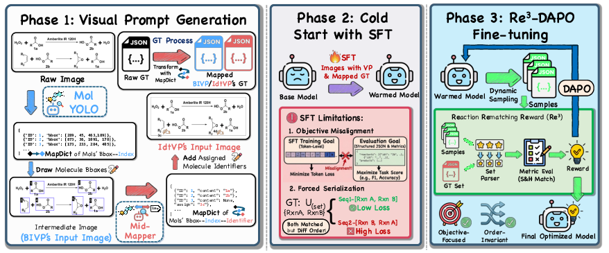

<p align="center">
  
</p>

<h1 align="center"> RxnID</h1>

**Molecular Identifier Visual Prompt and Verifiable Reinforcement Learning for Chemical Reaction Diagram Parsing**

[Project Page](https://chuangwang123.github.io/RxnID/) | [arXiv](https://arxiv.org/abs/2603.15011) | [Model](https://huggingface.co/songjhPKU/RxnID) | Dataset: coming soon | License: CC BY-NC 4.0

RxnID parses chemical reaction diagrams into structured reaction JSON. It uses **Identifier as Visual Prompting (IdtVP)** to anchor molecules by chemical identifiers, and **Re3-DAPO** to optimize reaction-level verifiable rewards during reinforcement learning.

<p align="center">
  
</p>

## News

- [07/2026] RxnID codebase cleanup for the ECCV 2026 release.
- [03/2026] Paper available on arXiv: [2603.15011](https://arxiv.org/abs/2603.15011).

## Highlights

- **IdtVP**: uses molecule identifiers such as `1a`, `2b`, or generated virtual IDs as visual anchors for VLM reasoning.
- **Mid-Mapper**: recognizes identifiers from detected molecule boxes and renders missing virtual IDTs for IdtVP.
- **Re3-DAPO**: RLVR training with soft/hybrid reaction-level rewards.
- **ScannedRxn**: benchmark for scanned historical reaction diagrams with real-world artifacts.
- **Open pipeline**: inference JSONL building, swift inference conversion, IdtVP evaluation, and verl training scripts.

## Main Results

F1 scores from the ECCV 2026 paper. H-F1 denotes Hybrid Match F1 and S-F1 denotes Soft Match F1.

| Model | Strategy | RxnScribe H/S | RxnCaption-15k H/S | ScannedRxn H/S |
|---|---:|---:|---:|---:|
| RxnID + RL | IdtVP | 75.0 / 85.9 | 64.4 / 74.5 | 56.3 / 76.2 |
| RxnID | IdtVP | 74.6 / 85.6 | 61.2 / 72.8 | 54.5 / 74.4 |
| RxnCaption + RL | BIVP | 75.9 / 86.9 | 64.1 / 73.6 | 45.1 / 59.2 |
| RxnCaption | BIVP | 72.2 / 86.2 | 59.8 / 70.4 | 51.0 / 69.5 |

## Repository Structure

```text
RxnID/
├── README.md / README_zh.md
├── LICENSE
├── requirements.txt
│
├── rxnid/
│   ├── build_inference_jsonl.py   # Build IdtVP ms-swift inference JSONL
│   ├── prompt.py                  # IdtVP prompt template
│   ├── identifier.py              # Mid-Mapper compatibility entry point
│   ├── evaluate_idtvp.py          # Soft/Hybrid evaluation for IdtVP JSON
│   ├── annotate_bivp.py           # BIVP baseline annotation utility
│   ├── evaluate_bivp.py           # BIVP/RxnCaption-style bbox evaluation
│   ├── mid_mapper/                # Identifier recognition and IDT rendering pipeline
│   └── rl/reward.py               # Re3-DAPO reward functions for verl
│
├── tools/
│   ├── convert_swift_jsonl_to_json.py
│   ├── convert_jsonl_to_verl.py
│   ├── check_paths.py
│   └── compare_grpo_rewards.py
│
├── scripts/
│   ├── run_inference.sh
│   ├── run_eval.sh
│   ├── prepare_data.sh
│   ├── run_mid_mapper.sh
│   └── run_rl_train.sh
│
├── demo/
│   ├── sample_images/
│   ├── sample_idts.json
│   ├── sample_gt.json
│   └── run_demo.sh
│
└── docs/
    ├── DATA.md
    ├── MID_MAPPER.md
    ├── MODEL_RELEASE.md
    ├── TRAINING.md
    └── OPEN_SOURCE_TODO.md
```

## Quick Start

```bash
git clone https://github.com/opendatalab/RxnID
cd RxnID
pip install -r requirements.txt
```

Run inference:

```bash
bash scripts/run_inference.sh \
    --image_dir /path/to/reaction_images \
    --idt_file /path/to/image_idts.json \
    --model songjhPKU/RxnID \
    --output_dir outputs/inference
```

`image_idts.json` maps image names to available identifiers:

```json
{
  "example.png": ["1a", "2b", "3c"]
}
```

Evaluate predictions:

```bash
bash scripts/run_eval.sh \
    --gt_file data/val_gt.json \
    --pred_file outputs/inference/prediction.json \
    --output_dir outputs/eval
```

Try the bundled sample images:

```bash
MODEL=songjhPKU/RxnID bash demo/run_demo.sh
```

## Mid-Mapper Identifier Pipeline

Run identifier recognition, identifier assignment/rendering, and IdtVP JSONL creation:

```bash
bash scripts/run_mid_mapper.sh \
    --image_dir /path/to/raw_images \
    --json_in /path/to/bivp_mapped.json \
    --model_path /path/to/mid_mapper_qwen_checkpoint \
    --num_splits 4 \
    --output_dir outputs/mid_mapper
```

Use `--dry_run` for a no-model smoke test. See [docs/MID_MAPPER.md](docs/MID_MAPPER.md) for the full workflow and per-step commands.

## Training

Convert SFT JSONL files to verl parquet:

```bash
bash scripts/prepare_data.sh \
    --train_file data/train.jsonl \
    --val_file data/val.jsonl \
    --output_dir data/parquet
```

Launch Re3-DAPO training with a local verl checkout:

```bash
bash scripts/run_rl_train.sh \
    --verl_root /path/to/verl \
    --train_file data/parquet/train.parquet \
    --val_file data/parquet/val.parquet \
    --model /path/to/sft-checkpoint \
    --output_dir outputs/rl
```

See [docs/TRAINING.md](docs/TRAINING.md) for details.

## Model Release

The public checkpoint is hosted at [songjhPKU/RxnID](https://huggingface.co/songjhPKU/RxnID). Release/upload notes are in [docs/MODEL_RELEASE.md](docs/MODEL_RELEASE.md).

## MolYOLO

MolYOLO is used as the detector in the BIVP baseline and Mid-Mapper pipeline. This repository does not vendor MolYOLO weights or code; please follow the [RxnCaption](https://github.com/opendatalab/RxnCaption) / [MolYOLO](https://github.com/songjhPKU/MolYOLO) release instructions.

## Citation

```bibtex
@misc{song2026molecularidentifiervisualprompt,
      title={Molecular Identifier Visual Prompt and Verifiable Reinforcement Learning for Chemical Reaction Diagram Parsing},
      author={Jiahe Song and Chuang Wang and Yinfan Wang and Hao Zheng and Rui Nie and Bowen Jiang and Xingjian Wei and Junyuan Gao and Yubin Wang and Bin Wang and Lijun Wu and Jiang Wu and Qian Yu and Conghui He},
      year={2026},
      eprint={2603.15011},
      archivePrefix={arXiv},
      primaryClass={cs.CV},
      url={https://arxiv.org/abs/2603.15011},
}
```

## License

This project is released under the CC BY-NC 4.0 license. See [LICENSE](LICENSE).
